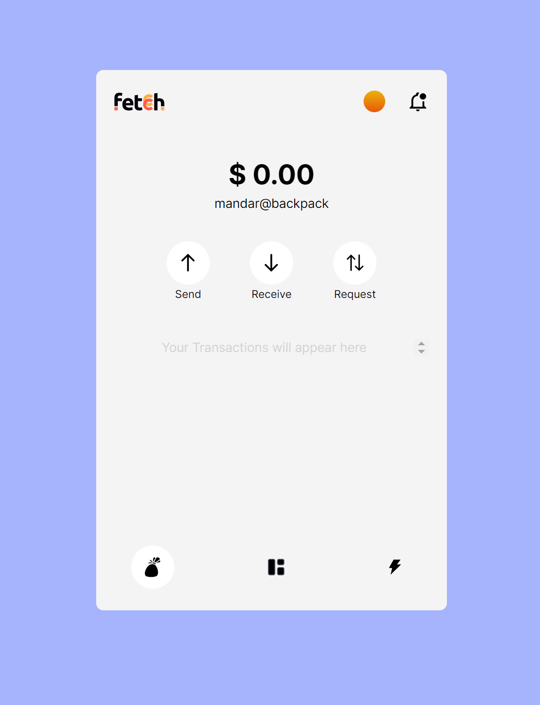
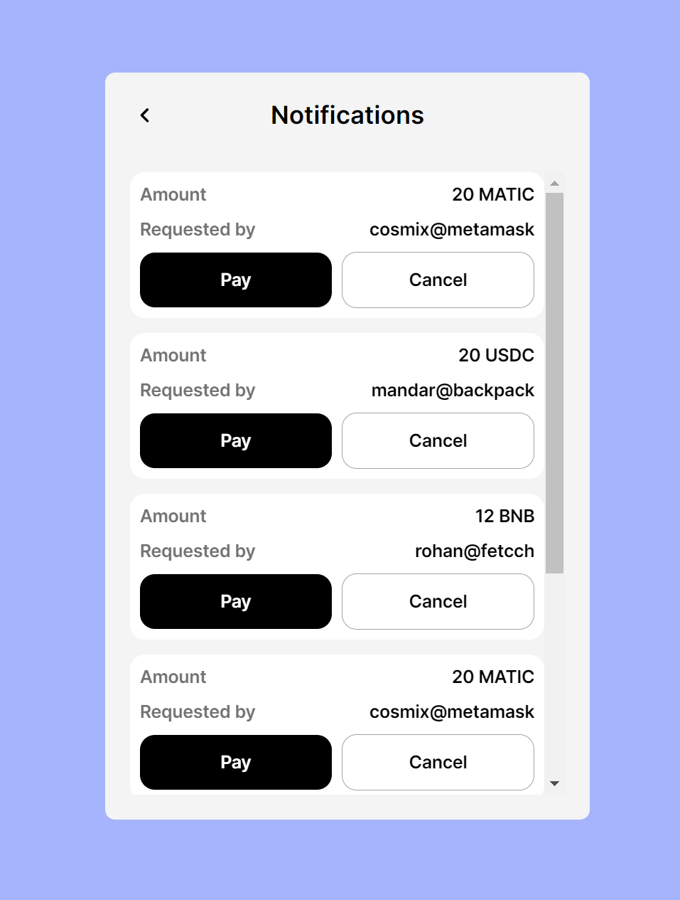
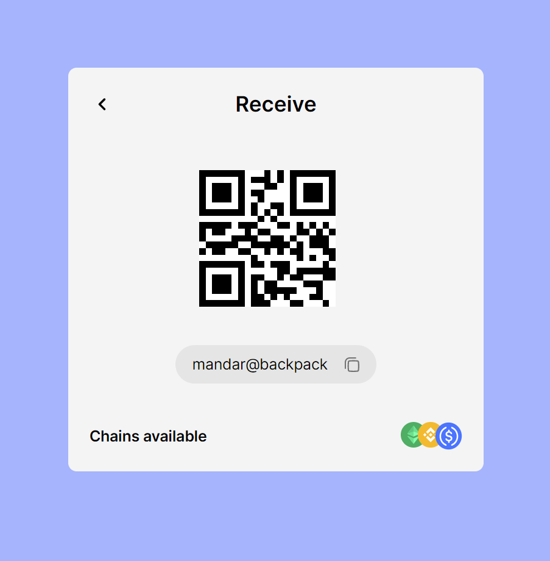
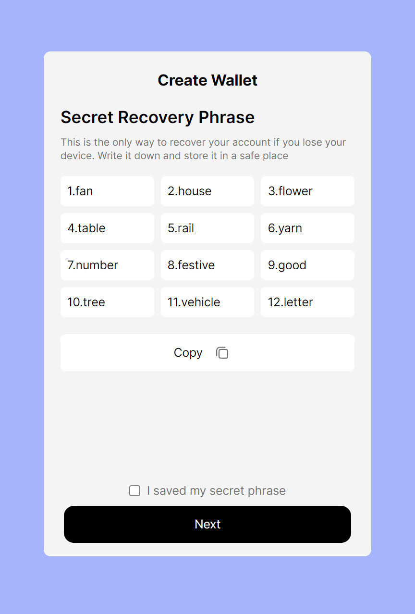

# Fetcch Demo

Automatic tribble is a clone of open source [backpack](https://github.com/coral-xyz/backpack) wallet to showcase features and functionality of [Fetcch](https://docs.fetcch.xyz/)

> Installation

```
git clone https://github.com/glitch-afk/automatic-tribble
cd automatic-tribble
yarn
```

> Commit

[Commitlint](https://github.com/conventional-changelog/commitlint) & [lintstaged](https://github.com/okonet/lint-staged) are  already configured to check the formatting and linting of the project to maintain consistency of code.
```
git add "your changes"
yarn commit
git push
```

## Features
> Landing Page



> Notifications



> Receive Page
- with QRCode support



> Generate Secret Phrase



> Connect Wallet (with rainbowkit)

